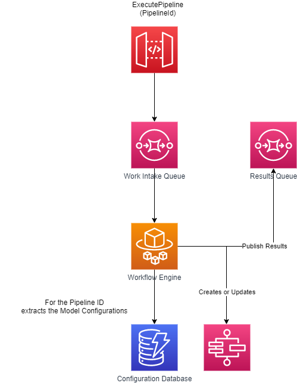

### ML Pipeline

The idea of this project is to make straight forward and simple deployments of ML workflows.

The project uses the Step Functions and uses the integration with AWS services (like Lambda, Glue, ECS and Sagemaker) to provide configurable ML workflows.

There are 2 key concepts that workflow engine uses: 

1. Module. 
2. Pipeline 

**1. Module**

Module is self-contained set of code that performs one step in the ML workflow (pipeline), such as data pre-processing, data transformation, model training, and so on.

Module is analogous to a function, in that it has a name, parameters, return values, and a body

**Module Specifications:** 
Each module will have an interface (input/output) specification and an implementation specification 

**Interface:** Input and Output the module requires. 

**Implementation:** This can be one of the following: Lambda | A Sage Maker Component | Glue ETL Job | ECS Docker Job. 

The elements specified in the implementation specification will be used  as  arguments to the module. 

As a general best practise, any specification will include the following: 

``name`` and ``Description``: A Human Readable name and description. 

``type``: The types are used as hints for pipeline authors and can be used by the pipeline system/UI to validate arguments and connections between components.
 
**Example Module Specification:** 

Example 1: Data Loader Lambda Component

```yaml
name: S3CSVDataLoader
description: A lambda function that takes in a S3 Data Source, validates the schema and splits the data into train, test and validation data set in 70, 15, 15 ratio split.
id: 123e4567-e89b-12d3-a456-426614174000
type: Lambda
inputs:
  - name: S3DataSource
    type: S3DataSourceUri
    value: s3://ml-pipeline-xgboost/data/customer-churn.csv
    ContentType: text/csv
    CompressionType: None
    fields_to_process: product_name|product_review

# Outputs can be referred by the down-stream component in a pipeline via $.outputs.{name}. Eg: $.outputs.ResultStatus
outputs:
  - name: ResultStatus
    type: JSON
    description: Describes whether its a success or a failue.
  - name: S3OutputArtifactUri
    type: String
    description: Data Set URI that contains the training data set csv.

``` 

Example 2: Create a Training Model

```yaml

name: XGBoostTrainer
description: Creates a Training Model using the Inputs specified.  
inputs: 
 - name: ImageName
   value: xgboost:latest
   type: String
 - name: Training Data
   type: S3DataSourceUri
   value: s3://ml-pipeline-xgboost/data
 - HyperParameters:
     objective: reg:logistic
     eval_metric: rmse
     num_round: 5
outputs: 
 - name: ModelUri
   type: S3DataSourceUri
   value: s3://ml-pipeline/{job-execution-name}/models

```

**2. Pipeline**

A pipeline is a ML workflow, including all of the components in the workflow and how the components relate to each other.

When you run a pipeline, the system launches a Step Function corresponding to the Modules in your pipeline.

Each of the steps, on error will stop the execution, clean up the pipeline and notify via email.  
```yaml

name: XGBoostTrainingPipeline
description: This Pipeline is used for Predicting customer Churn Rate. 
type: TrainingPipeline

Steps: 
 StartsAt: Generate Data Set 
 Generate Data Set: 
  ModuleId: 123e4567-e89b-12d3-a456-426614174000
  Type: Task
  Next: Train Model
Train Model:
  ModuleId: 123e4567-e89b-12d3-a456-426614174000
  Type: Task
  Next: Batch Transform
Batch Transform:
  ModuleId: 123e4567-e89b-12d3-a456-426614174000
  Type: Task
  End: True

```

**Implementation:**
Assuming there are pre-published modules:

1. Generate Data Set
2. Train Model using Sage Maker's Built in algorithm (XG Boost)
3. Publish Module.  

Workflow Orchestrator will use these module specs to create a pipeline. 




### Pseudo Code
```python

from stepfunctions.steps import *
from stepfunctions.workflow import Workflow


def createDynamicTask(definition):
    if (definition.type == "lambda"):
        return LambdaStep(
            state_id=definition.id,
            parameters={"Payload": {
                definition.parameters
                }
            }
        )


# This will ideally come from Dynamodb
with open('dynamicDagConfigFile.yaml') as f:
    configFile = yaml.safe_load(f)
    steps = configFile['Step']
    chain_of_steps = []
    for step_definition in steps:
        chain.append(createDynamicTask(step_definition))
    
    pipe_line_definition =Chain(chain_of_steps)
    pipeline = Workflow(
        name="DataValidationPipeline",
        definition=pipe_line_definition,
        role=workflow_execution_role
    )
    pipeline.execute()
```
 
